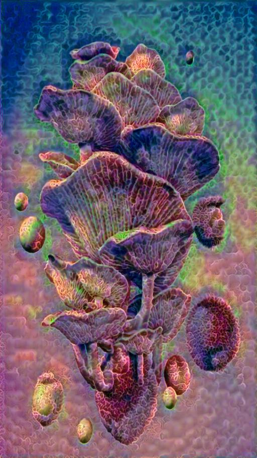

# Artistic Image Generation with VQGAN and CLIP

## Introduction

This notebook explores various image generation techniques using VQGAN and CLIP, with the primary goal of fostering creativity and understanding these methods better. Whether you're an artist, a programmer, or just curious, this notebook provides a playground for creating unique and captivating images.

## Purpose

This notebook serves as an educational resource and creative outlet. It offers methods for generating art and imagery, making it an excellent resource for those interested in art, machine learning, or simply exploring new creative techniques.

## Features

- Diverse image generation techniques.
- A user-friendly interface for experimentation.
- Detailed documentation to aid your creative process.
- Alternative implementation in PyTorch (original was in TensorFlow).

## Note on Google Drive

Please note that this notebook includes code that enables Google Drive for downloading images. However, it's worth mentioning that using the temporary runtime directory may not be the most efficient method for saving progress. This can be disabled if running the notebooks locally. See comments in code. 

## Getting Started

1. Clone this repository to your local machine.
2. Open the notebook in your preferred environment.
3. Follow the provided documentation to start generating your own artistic images.

## Usage

The notebook is designed to be straightforward to use, even for those with minimal coding experience. Explore different techniques, tweak parameters, and let your creativity flow.

## Contributions

Contributions to this project are welcome. If you have ideas for improving or expanding upon the notebook, feel free to submit a pull request.

## License

This project is licensed under the MIT License - see the [LICENSE](LICENSE) file for details.

---

Enjoy your journey into the world of artistic image generation with VQGAN and CLIP!

